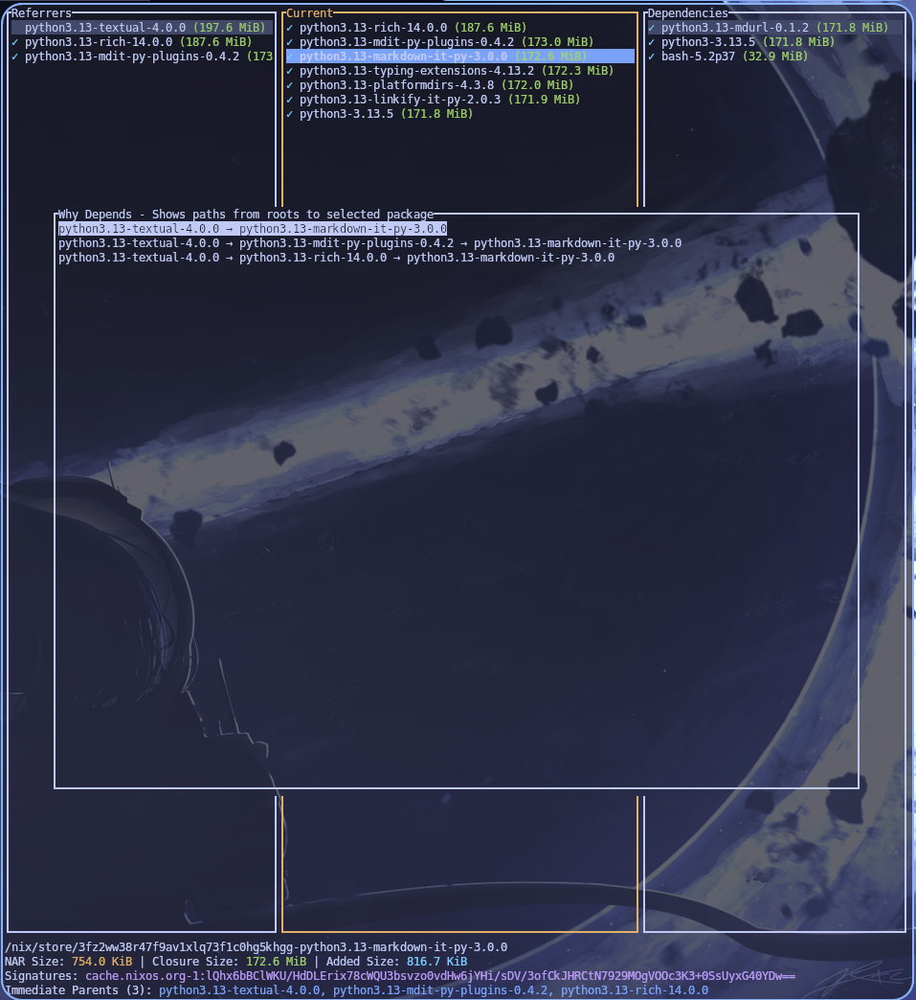

# nix-tree-rs

A Rust port of [nix-tree](https://github.com/utdemir/nix-tree), providing an interactive visualization of Nix store dependencies.

## Overview

`nix-tree-rs` is a terminal user interface (TUI) that allows you to interactively browse and analyze the dependency tree of Nix store paths. It helps you understand why packages are in your Nix store and how much space they consume.



## Features

- 🌳 **Interactive Navigation**: Three-pane interface showing referrers, current selection, and dependencies
- 📊 **Size Analysis**: View NAR size, closure size, and added size for each package
- 🔍 **Search**: Find packages by name within the dependency tree
- 📈 **Why-Depends**: Discover all paths from GC roots to a specific package
- 🔤 **Multiple Sort Orders**: Sort by name, closure size, or added size
- ✓ **Signature Verification**: See which packages are signed
- ⌨️ **Vim-like Keybindings**: Familiar navigation for vim users

## Installation

```bash
nix run github:lonerOrz/nix-tree-rs
```

## Usage

### Basic Usage

```bash
# Analyze current system profile (auto-detects from /run/current-system or ~/.nix-profile)
nix-tree

# Analyze specific store paths
nix-tree /nix/store/abc123-package-1.0 /nix/store/def456-package-2.0

# Analyze a derivation and its dependencies
nix-tree -d /nix/store/...firefox.drv

# Use with nix flakes
nix-tree nixpkgs#hello
```

### Keybindings

#### Navigation

- `j`/`↓` - Move down
- `k`/`↑` - Move up
- `h`/`←` - Move to previous pane (go back)
- `l`/`→` - Move to next pane (explore dependencies)
- `Enter` - Select item
- `Page Up`/`Page Down` - Scroll quickly

#### Actions

- `/` - Search for packages
- `w` - Show why-depends (displays all paths from roots to selected package)
  - In why-depends view: use `h`/`l` to scroll horizontally
- `s` - Change sort order (cycles: closure size → added size → alphabetical)
- `?` - Toggle help
- `q`/`Esc` - Quit or close modal

### Understanding the Display

The interface shows three panes:

- **Left pane (Referrers)**: Packages that depend on the selected item
- **Middle pane (Current)**: The currently focused level of the tree
- **Right pane (Dependencies)**: Packages that the selected item depends on

For each package:

- `✓` indicates the package is signed
- Package name is shown with size in parentheses
- The status bar shows detailed information about the selected package

**Size Terminology**:

- **NAR Size**: The size of the package itself
- **Closure Size**: Total size including all dependencies
- **Added Size**: Additional space this package adds (excluding shared dependencies)

## Building from Source

```bash
# Clone the repository
git clone https://github.com/lonerOrz/nix-tree-rs
cd nix-tree-rs

# Build with Cargo
cargo build --release

# Or use Nix
nix build
```

## Development

```bash
# Enter development shell
nix develop

# Run tests
cargo test

# Format code
cargo fmt

# Run linter
cargo clippy
```

## License

This project is licensed under the MIT License - see the LICENSE file for details.

## Acknowledgments

This is a Rust port of the original [nix-tree](https://github.com/utdemir/nix-tree) by Utku Demir.
